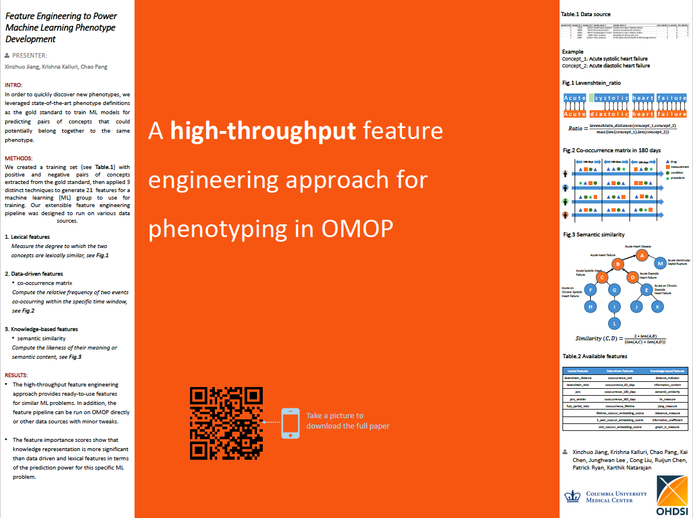

# Feature Engineering to Power Machine Learning Phenotype Development

This study focuses on feature engineering which is a prerequisite for modeling phenotype
characterization. Based on concept pairs extracted from the eMERGE Network by reference set group,
four types of features were created. Lexical features describe the linguistic similarity of concept pairs.
Semantic features measure the distance between two concepts in semantic ontology. Co-occurrence
features are generated to show the prevalence of two concepts occurring within the same time window.
The last feature group is concept embeddings which computes the dependence of two concepts.

## Lexical Features:  
Lexical Features measures the degree to which the two concepts are similar linguistically. Lexical similarity of 1 means total overlap and 0 means no overlap. In lexical similarity measures we calculated 5 measures for each concept pair including Levenshtein_distance, Levenshtein_ratio, Jaro, Jaro_winkler, Fuzz_partial_ratio.
## Semantic Features:
The similarity score between two concepts is based on the likeness of their meaning or semantic content. We chose these set of features to help better understand the semantic ontology structure and relationship between the concept pairs which will add additional power to modelling work. In this group, 8 different Semantic features were extracted. They are Distance_indicator, Semantic_similarity, Lin_measure2, Jiang_measure2, Relevance_measure2, Information_coefficient2, GraphIC_measure2, Mica_information_content3.
## Co-occurrence Features:
All the co-occurrence matrices are computed based off of domain tables from the latest ohdsi_cumc_deid (inpatient and outpatient data) database available on iNYP. Domain tables include condition_occurrence, procedure_occurrence, drug_exposure, measurement, and observation. We used various time windows to measure the co-occurrence matrices, starting from 60 days to lifetime. The matrices are Co-occurrence_60_days/_90_days/_180_days/_360_days/_lifetime.
## Concept Embeddings Features:
The GloVe algorithm is run on the co-occurrence matrix to generate the concept embeddings4. As of now only cooccurrence_lifetime is used for computing the embeddings. Except for Lifetime_cooccur_embedding_cosine, 5_year_cooccur_embedding_cosine and Visit_cooccur_embedding_cosine are under development.

##[Abstract Submitted to OHDSI Symposium 2019](documents/PhenotypeFeaturesAbstract.pdf)

##Poster Presented at OHDSI Symposium 2019
##
[Find OHDSI Symposium 2019 Poster PDF version here.](documents/OHDSI2019_poster.pdf)

